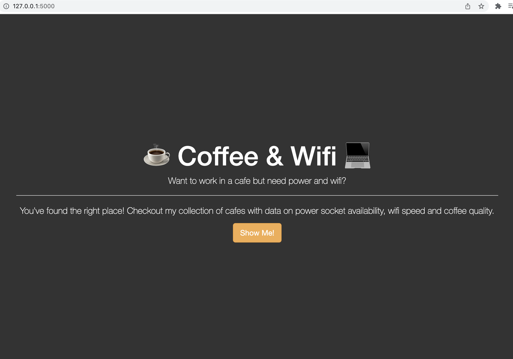
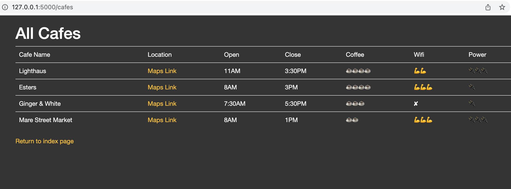
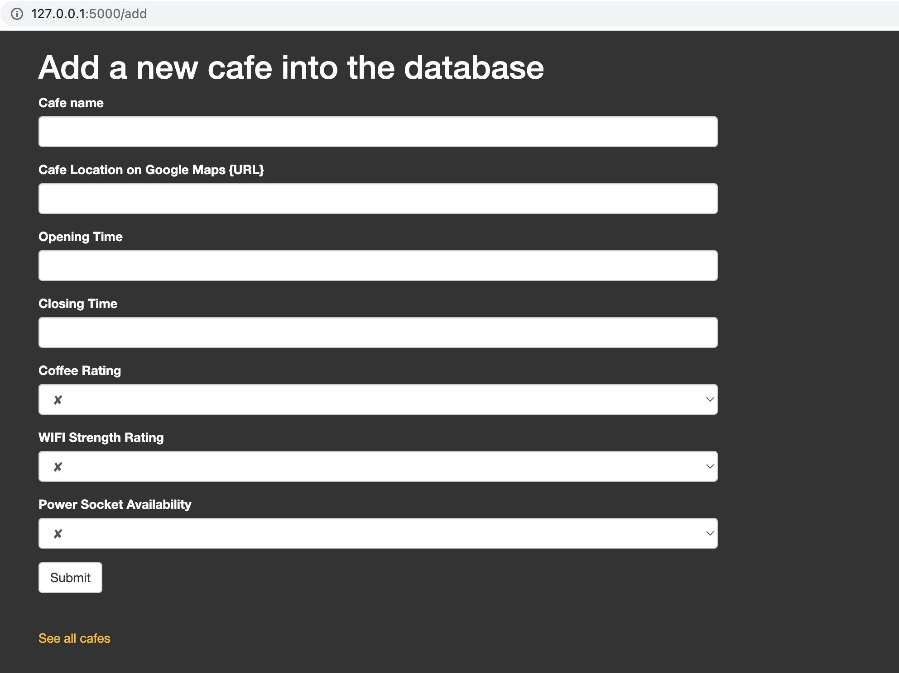

# Cafes_website (Frontend Project)

 

## Introduction
### In this repository we have created a wesite which uses:
* FlaskForms to create forms which can be filled by the users.
* Boostrap with the help of Jinja Templating
* WTForms to create quick flask form
* Html and CSS to create and style our website pages.
* GET and POST methods in the /add route (third image below)
* Flask web framework to runserver
 

 

## Description
### **>** Here we have created a cafes website which helps users to get information about the different cafes nearby in case they plan to visit any. The information collected by this website includes the closing and opening hours, wifi availabity and strength, coffee rating and power outlets availabity at the coffee shop.

 

### **>** Our (/cafes) route shows the users with a list of previously added cafes with all its details so they can select the one they are interested in visiting via the help of the maps link provided.

 

### **>** Finally we have the (/add) route which is basically for users who would like to leave a review for a newly visited cafe which is not in the cafes list. This form will retrieve all the displayed information about the new cafe and append it to our list when clicked submit.

